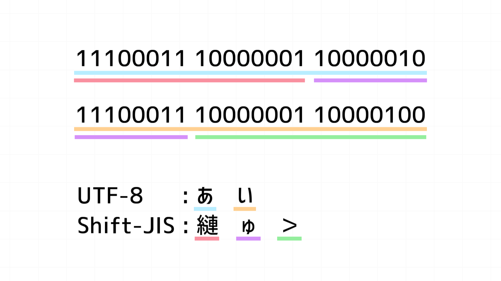

結論：ビットパターン的にそうなりやすいから 
 
なんて一言で片付いてしまいますが、文字化けでよくあるShift_JISとUTF-8の文字化けの仕組みについて調べてみました。 

## Shift_JISとUTF-8

よく文字化けが発生する最たる例がShift_JISとUTF-8との置換時です。 
何故文字化けするかですが、構造やバイト数が異なる文字を無理やり解釈しようとすることで文字化けが発生する様です。 

## 置換してみる

UTF-8で「あい」をShift_JISにすると「縺ゅ＞」となります。 
文字数が違う理由としては、UTF-8では「あい」は3バイト文字で、Shift_JISにすると2バイトとして扱われるため3文字になります。※おまけ参照 
 
「あい」をUTF-8の文字コードに従って2進数(16進数)に変換すると 

> 💡 あ: 11100011 10000001 10000010(E38182) 
> い: 11100011 10000001 10000100(E38184) 

となります。 
 
これをShift_JISの文字コードに従ってエンコードし直すと、 

> 💡 縺: 11100011 10000001(E381) 
> ゅ: 10000010 11100011(82E3) 
> ＞: 10000001 10000100(8184) 

となるわけですね！ 

## 何で糸偏の似通った文字が多いのか

UTF-8の文字コードを確認するとよくわかるのですが、ひらがなとカタカナはE381xx-E383xxから始まります。 
E381-E383のShift_JISはそれぞれ「縺」「繧」「繝」であるため、日本語の文章が文字化けするとこれらの文字が頻出するという理由でした！ 

### おまけ(UTF-8とShift_JISの文字が何バイトか見分ける表)

* UTF-8

| 1バイト | 0xxxxxxx |
| --- | --- |
| 2バイト | 110xxxxx 10xxxxxx |
| 3バイト | 1110xxxx 10xxxxxx 10xxxxxx |
| 4バイト | 11110xxx 10xxxxxx 10xxxxxx 10xxxxxx |

* Shift_JIS

| 1バイト | 最初の1バイトが0x00-0x7E,0xA1-0xDFの中にある |
| --- | --- |
| 2バイト | 最初の1バイトが0x81-0x9F,0xE0-0xEFの中にある |
