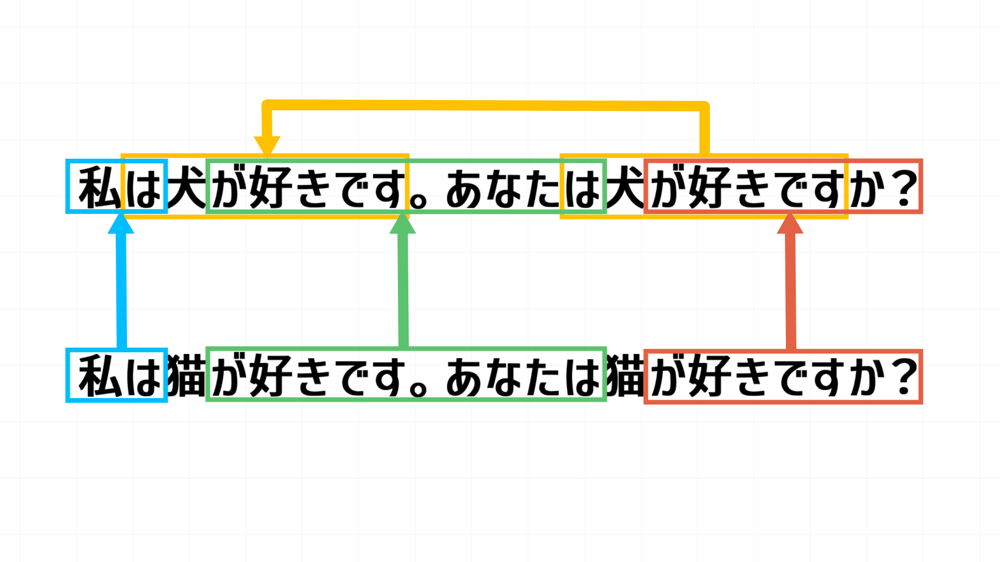
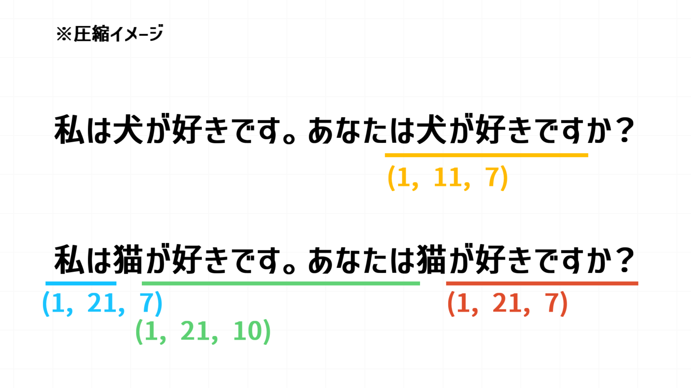

# ZIP圧縮の仕組み

## TL;DR

一致する文字列と頻出する文字を変換することで圧縮している！ 

 

普段何気なく使っているZIP圧縮の仕組みについて調べてみました。 
ZIP圧縮にはDeflateと呼ばれるアルゴリズムが用いられているそうで、さらに細かく分けると「LZ圧縮(LZSS)」と「ハフマン符号化」を組み合わせたアルゴリズムで圧縮がされているようです。 

### LZ圧縮

LZ圧縮では、過去に出てきたデータを参照することで、データを短く表現しています。 
例えば 

> 💡 私は犬が好きです。あなたは犬が好きですか？ 
> 私は猫が好きです。あなたは猫が好きですか？ 

という文章があったとして、これを圧縮すると以下のようになります。 

仕組みとしては、過去同じデータがあった場合には一致フラグと何文字前から何文字分コピーできるかの情報を持たせて圧縮をしているようです。(正確にはバイト数ですが、今回は未考慮) 
意図的に圧縮できそうな文章をAIに考えてもらいましたが、2枚目の画像の個所は線を引いた箇所がまるっと圧縮できるそうです！ 

### ハフマン符号化

ハフマン符号化では、頻出する文字ほど短い符号を割り当てて、データ全体を短くします。 
数値の割り当てはハフマン木で被らないよう出現頻度の高い順から割り当てられます。 
 
LZで圧縮された後に、ハフマン符号化で具体的にどう圧縮されるかを示す資料が見つからなかったので推測にはなりますが、「、」や「。」等の圧縮できないけれど頻出する単語で圧縮が見込めるものと思われます、、！ 

調べていくと、スライディングウィンドウやパッケージ・マージ・アルゴリズムなどDeflateの中でも様々なワードが出てきて、頭のいい人がすごいことを考えたんだなぁと、、、 
それらをさらに工夫して、別の圧縮形式が作られていると考えると、おもしろいですよね～！ 