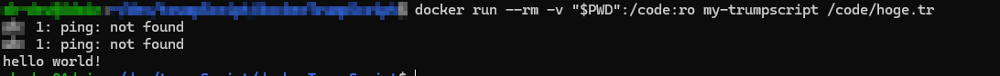
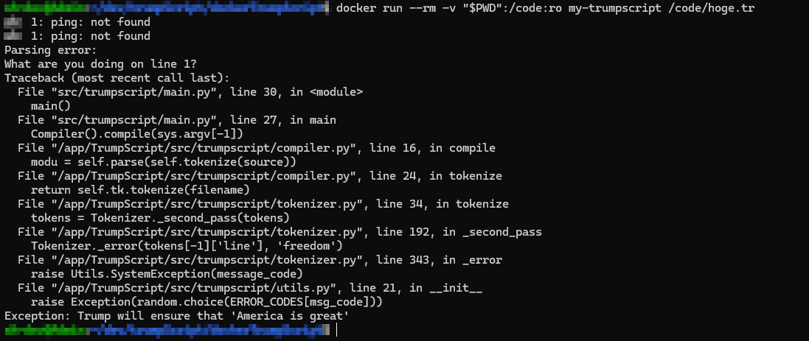

お疲れ様です。<br>
トランプ大統領が就任して早2ヶ月、早いものだと思いつつもまだまだニュースでの話題も尽きないですね！<br>
ということで、トランプ大統領の言動をベースに作られた「TrumpScript」を触ってみました！<br>

## hello world!

まずはいつものように「Hello World!」出力と言いたいのですが、この言語では「Hello World!」を出力することができません！<br>
正確には「hello world!」であれば出力できるのですが、ひとまず「hello world!」を出力するコードを以下に示します。<br>

```javascript
say "Hello World!"
America is great
```

2行目の突っ込みは置いておいて、出力結果を確認してみます！<br>



コードでは「Hello World!」としているのに出力では「hello world!」となってますね、、<br>
原因は、この言語が大文字小文字の区別がないためのようです。トランプ大統領は小さいことは気にしないということでしょうか笑<br>
<br>
2行目の「America is great」ですが、記載せずに実行すると以下のような出力になります。<br>



いろいろエラー出てますが、肝心なのは一番下の出力「Exception: Trump will ensure that 'America is great’」<br>
全てのプログラムは「America is great」で終わる必要があるようです。<br>

## 特徴

hello worldの時点でお察しかと思いますが、とにかく制約が多くトランプ大統領らしい(？)言語を追求したプログラミング言語が「TrumpScript」です！<br>
作成元のリポジトリのREADMEに特徴がまとめられていたので翻訳したものを以下に載せます。<br>

* 浮動小数点数はなく、整数のみです。アメリカは決して中途半端なことはしません。

* すべての数字は100万より厳密に大きくなければなりません。小さなことは我々にとって取るに足りません。

* importステートメントは許可されていません。すべてのコードは国産でアメリカ製でなければなりません。

* TrueとFalseの代わりに、factとlieというキーワードがあります。

* 変数名として使えるのは、最も一般的な英単語、トランプのお気に入りの言葉、現役政治家の名前のみです。

* エラーメッセージのほとんどは、トランプ本人の発言からの直接引用です。

* すべてのプログラムは「America is great」で終わらなければなりません。

* 我々の言語は、フォーブスの45億ドルを自動的に100億ドルに修正します。

* 生の形では、TrumpScriptはWindowsと互換性がありません。なぜならトランプはPCを信じるタイプの男ではないからです。

* TrumpScriptは、アップルがカリフォルニア州のイスラム過激派テロリストカップルに関する携帯電話情報を当局に提供するまで、OS Xとすべてのアップル製品をボイコットします。

* 言語は完全に大文字小文字を区別しません。

* 実行中のコンピューターが中国製の場合、TrumpScriptはコンパイルしません。アメリカの技術機密を盗まれたくないからです。

* 壁を構築することで（--Wall フラグを提供）、TrumpScriptはメキシコのロケールを持つマシンでの実行を拒否します。

* システム上に中国からの正当な「SSLサーティフィケート」を装った共産主義者がいる場合、警告します。

* rootモードでは実行しません。なぜならアメリカは偉大になるためにあなたの助けを必要としないからです。トランプだけで十分です。

* 小さな手でも簡単に入力できます。

* コンピューター上でTrumpScriptが全く実行できない場合（おそらく最も一般的な2つのオペレーティングシステムを許可していないため）、--shut_upフラグを指定して、とにかくコードを実行したいことをインタープリターに知らせることができます。

gitでcloneしたため内部のコードを確認できましたが、以下の関数あたりは皮肉たっぷりで印象に残りました。<br>

* boycott_apple関数：apple製品の場合は例外

* no_commie_network関数：FacebookやAlibabaといったサイトのアクセス可否で例外

## 小話

今回Exceptionも確認したかったため、ただ動作するオンライン上のインタプリタは用いずに環境をきちんと作成したのですが、作成元のGitHubリポジトリでcloneして環境構築したところ大量にエラー出たんですよね、、<br>
原因自体はPythonの実行バージョンが異なっていただけでしたが、Dockerfileいじったり言語の仕様でrootユーザだとエラーになったりとある意味だいぶ苦労した環境構築でした、、、<br>
<br>
また、AIに問題を考えてもらってそれを解いてみようとしましたが、用意されている処理が少ないこともあり現実的でない問題も多く断念しました、、インパクトのある言語だったためにちょっぴり残念です。次の言語ではリベンジしたいですね🔥<br>
<br>
America is great<br>