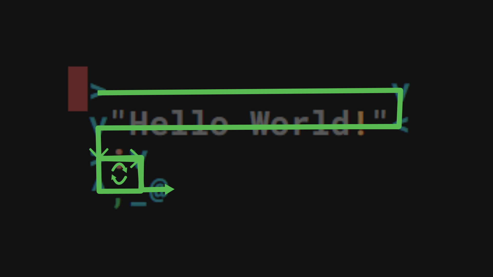
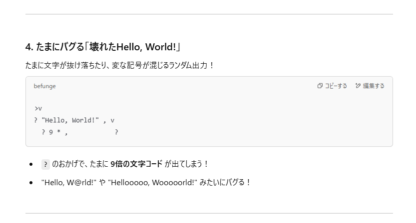

お疲れ様です。<br>
突然ですが、普段皆さんが触っているプログラミング言語は上から順に実行される言語がほとんど全てといっても過言ではないかと思います。<br>
そんな中、上下左右縦横無尽に処理を実行するなかなかにぶっ飛んだ言語を触ってみたので紹介いたします！<br>
<br>
言語名は「Befunge」(今回触ったのはBefunge-93)といい、2次元のグリッド上を上下左右に移動しながら命令を実行するような言語です。<br>

## Hello World!

```javascript
 >              v
 v"Hello World!"<
 >:v
 ^,_@
```

Esolang Wiki(https://esolangs.org/wiki/Befunge)に載っている「Hello World!」プログラムを抜粋してきました。<br>



処理の前提として、「^」「v」「<」「>」で処理の方向が定まります。(vなら下方向に実行)<br>
順に説明すると左上から始まり、> v <の後は「!dlroW olleH」の順にスタックにプッシュします。<br>
それを3行目と4行目でぐるぐる回しながらポップすることで「Hello World!」を出力するプログラムのようです。<br>

## AIに出題してもらう

WikiのHello World出力プログラムについてはザックリ解説しましたが、上記コードだけではこのイカれた言語の魅力を伝えきれていないなぁ…ということでAIに例題を考えてもらいそれを実装してみました！<br>



テーマについては考えてもらいましたが、生成されたコードでは2文字目の「v」時点で下方向にずっと進んで無限ループになり動かないのと、これだけだと変な出力にもなり微妙なので、これをベースに改良してみました！<br>

```javascript
>                     v
    v "Hello World!"0 <
  > v v          <
           >\:,\ ^
>:|:?6>1-: |
           >$$             v
  @         >" "-,         v 
    >:"Z"-0`|       >" "+, v
            >:"@"-0`| 
                    >    , v
^                          <
```

今回は、以下3点を追加実装した「Hello World!」になります！<br>

* 同じ言葉を5回繰り返して出力する

* 大文字は小文字に、小文字は大文字に、記号はそのままで出力する

* 上記2つの処理を1文字ごとにランダムで実行する

実行結果としてはこちら<br>

それぞれザックリ何をしているかは以下です。<br>

* ループ処理: 6から1を引いていき、0になったらループから外れる

* 文字変換: ASCIIコードに対して、特定の値以上か以下かでif分岐

* ランダム実行: 「?」が上下左右のどれかランダムに方向を決めるため、右と下方向に上記の処理を記載※左と上方向は再度「?」に向かうように記載

<br>

今回触れたBefungeは2次元の実行でしたが、他にも3次元のTrefungeやn次元のNefungeなるものも存在するようなので気になる方はぜひ触って感想を教えてください！😆<br>

<br>