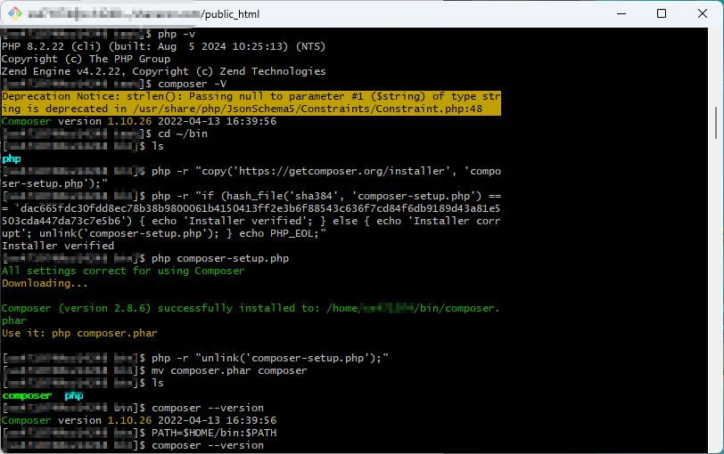
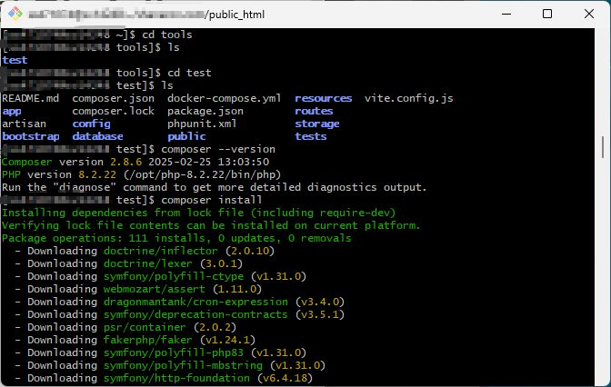
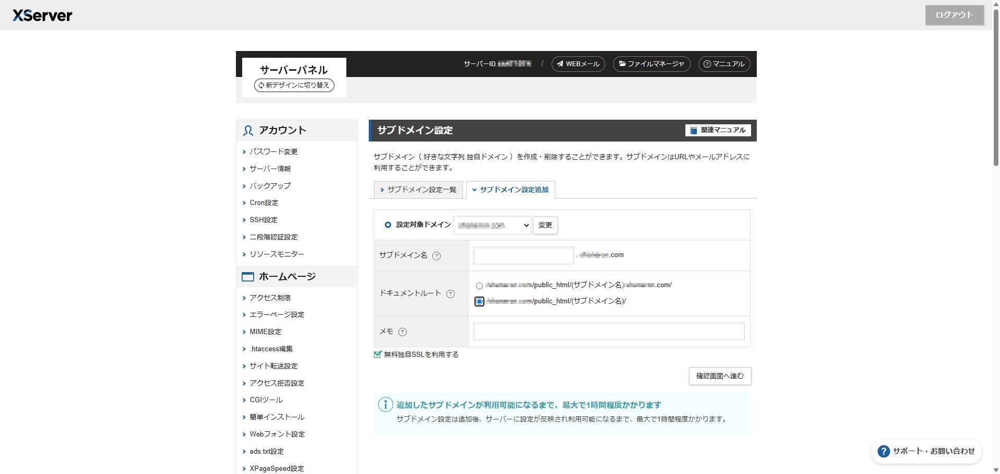
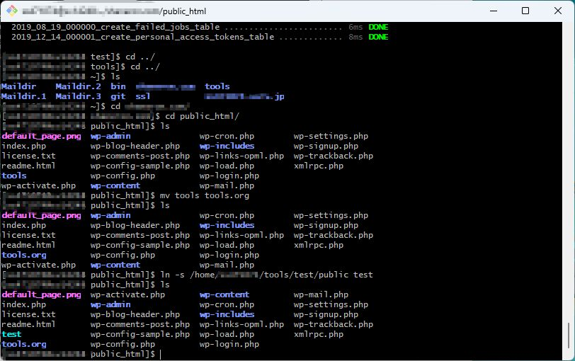
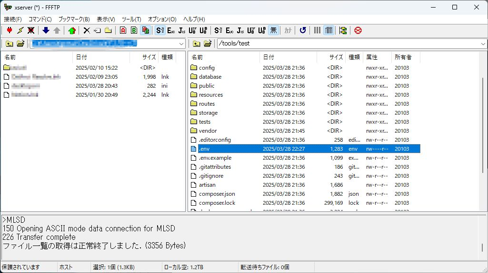

# サブドメインへWebアプリのデプロイを試みる

お疲れ様です。<br>

少し前、契約しっぱなしだったXserverの存在を思い出しまして、そういえば自分のサーバにデプロイしたことないな、、デプロイの練習でもしてみるか！<br>
ということで、備忘録がてらの投稿になります<br>

## 前置き

元々大学生の時にXserverを契約していたのですが、その時Wordpressだけ触って満足しちゃったんですよね<br>
で久々に思い出して、色々触ってみようかなーと思ったのですが、既存のものはそのままにしておきたかったのでサブドメインに上げられないか試してみました！<br>

## PHPとcomposerの環境を整える

サブドメインにLaravelをデプロイするにあたって、サーバー側にPHPとcomposerが必要だったのですが、すでに用意してある！<br>
と思ったのも束の間、バージョンが足りなかったようです。<br>
なのでPHPとcomposerのバージョンをアップデートしておきます。<br>





## サブドメインの設定

これは思いのほか簡単でした。<br>
サーバー側にサブドメインを設定できる項目があったのでそこにサクッと追加して待つだけで設定できました！(他のサーバーだと難しかったりするのでしょうか、、？)<br>



## シンボリックリンクの設定

この辺はコマンドをざっと流して完了です<br>



<br>

## .envの更新

前から気になっていたことで、.gitignoreに指定されてるenvファイルはデプロイの時どうするんだ？？<br>
と思っていましたが、FTPツールで上げるしかなさそうですね、、<br>



<br>

## .htaccessの設定

正直これが一番大変でした…<br>

いい調子でデプロイ作業進んで、終わった！と思いアクセスしてみたらこの有様でした、、<br>


で、サーバーログをよくよく確認したところ<br>

```javascript
[Fri Mar 28 23:14:23.539402 2025] [core:error] [pid xxxxxx:tid xxxxxx] [client xxx.xxx.xxx.x:xxxxx] AH00124: Request exceeded the limit of 10 internal redirects due to probable configuration error. Use 'LimitInternalRecursion' to increase the limit if necessary. Use 'LogLevel debug' to get a backtrace.
```

リダイレクトループなるものが発生していそうで、、<br>
調べた限り.htaccess周りで問題が起きてそう、、ということはわかりましたが、.htaccessなんて今までちゃんと触ったこともなく手探りで進めました。<br>
サブドメインゆえにメインのドメインと競合しているのか、、？とか必死に考えてました<br>
<br>
結果としては、、、<br>
全く別の箇所のシンボリックリンクの設定が間違えているだけでした、、<br>
サブドメイン名と指定したフォルダ名が違うというすごいケアレスミスでしたが3時間ぐらい悩んでました、、<br>
※Laravelのプロジェクト内でも.htaccessの記載は必要だったりします。<br>

## まとめ

冷静に考えればすごいしょうもないことで失敗してましたが、まあ学びになったということで笑<br>
後はデータとか一元管理できるWebアプリとか作れたら面白そうだなーと<br>
そういったところも今後やっていきたいですね✨<br>

## 参考サイト

https://biz.addisteria.com/laravel_project_deploy1/<br>

<br>
