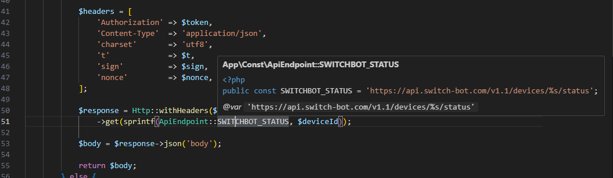
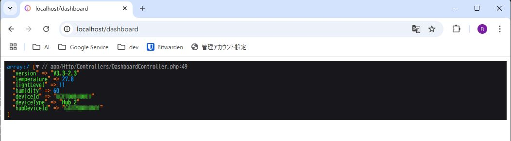
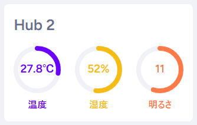
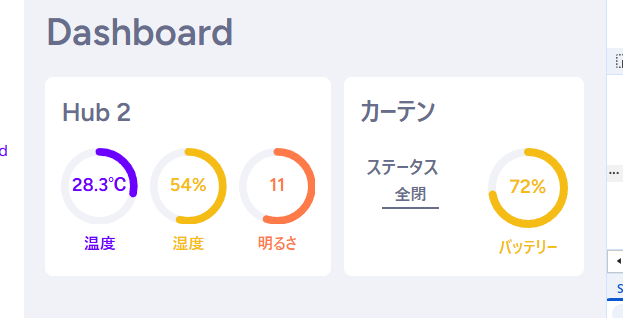

お疲れ様です。<br>
少し前にデプロイは試しましたが、そのままというのも味気ないのでいい感じの何かないかなーと調べてました。<br>
そうしたらSwitchBotAPIなるものがあることを知り、自宅の気温等を取ってくることができたので紹介いたします。<br>

## 必要な情報を収集する

SwitchBotAPIでデータを取得するのに必要な項目は以下3つです。<br>

* Token

* Secret

* DeviceId

TokenとSecretに関してはユーザに紐づいているもので、SwitchBotアプリから確認できます。<br>
DeviceIdに関しては以下ページを参考にしつつGASで取得しました。<br>

https://qiita.com/katta1024/items/6a5af91c986fe3c47f4d<br>

## パッケージの導入

ちょうど良さそうなパッケージを見つけたので導入。<br>

```shell
composer require revolution/laravel-switchbot
```

https://packagist.org/packages/revolution/laravel-switchbot<br>

## APIを叩き、データを取得する

認証情報やらヘッダーの情報をそろえてAPIのURLに対してリクエストします。<br>



<br>
気温情報や湿度等取得できました。<br>



## 見た目だけ少し整える

データを取得することはできたので、AIにSVGでそれっぽく見た目を整えてもらい完成です。<br>



## おまけ

追加で家にあるカーテンの情報も取得してみました！<br>



スイッチボットは他にも家のロックだったりロボット掃除機だったりいろんなものと連携できそうなのでいろいろ連携してみても面白そうですね<br>
API使わずとも普通に便利なので皆さんも是非SwitchBot購入してみてはいかがでしょうか？？<br>