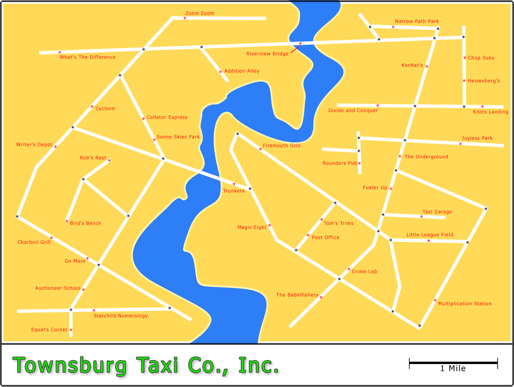
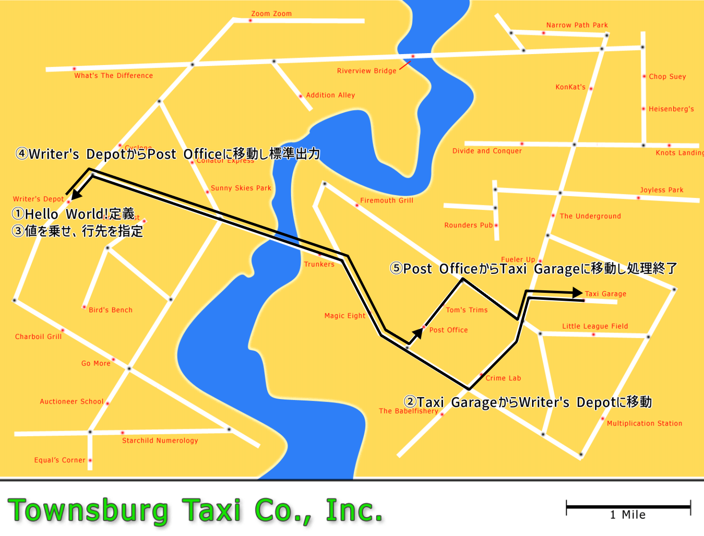
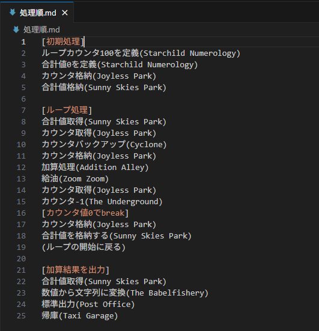
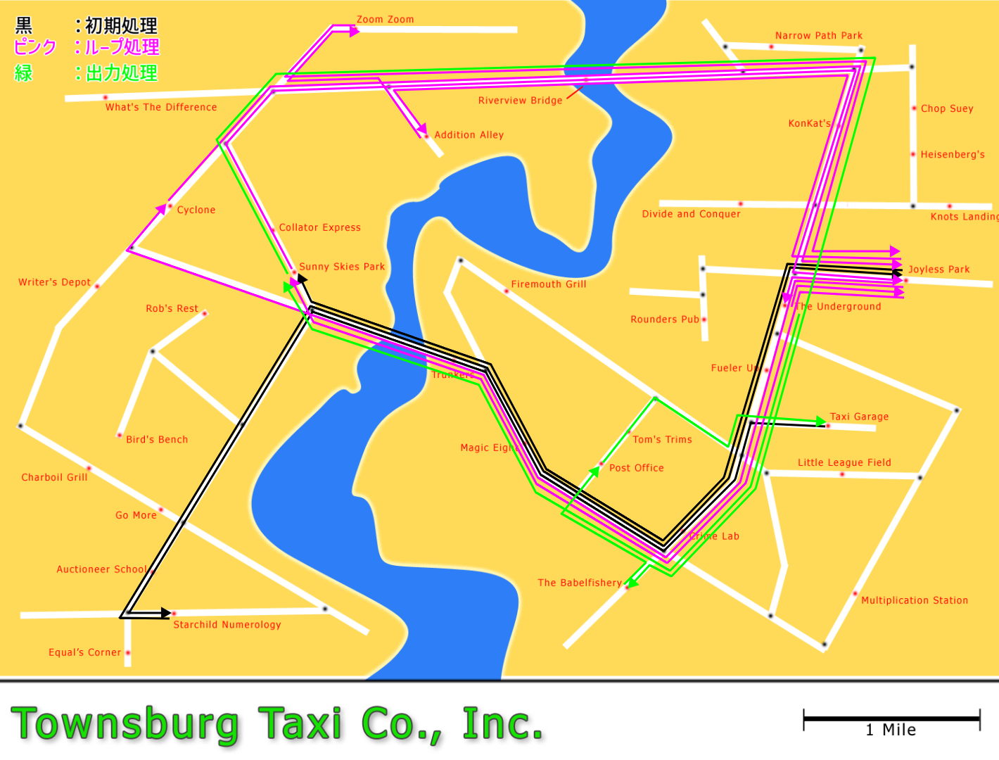

お疲れ様です。<br>
また面白そうな言語を見つけたので共有いたします。<br>
言語名はTaxi。タクシーを運転し行先によって処理を決定する言語です。<br>

## Taxiについてざっくり

Taxi言語はその名の通り、タクシーに乗客(値)を乗せ、あっちこっちに移動させて処理を行わせるプログラミング言語です。<br>
このプログラムが走るのはTownsburgという街ですがこの街には35個もの施設があり、止まる場所によって処理が変わります。<br>
数が多いのでいくつかピックアップすると、文字列を分割する場所や数値→文字列に変換する場所等です。<br>



引用: https://bigzaphod.github.io/Taxi/map-big.png<br>

## Hello, World!解説

Hello, World!のコードはずばり以下になります。<br>

```shell
"Hello, World!" is waiting at the Writer's Depot.
Go to Writer's Depot: west 1st left, 2nd right, 1st left, 2nd left.
Pickup a passenger going to the Post Office.
Go to the Post Office: north 1st right, 2nd right, 1st left.
Go to the Taxi Garage: north 1st right, 1st left, 1st right.
```

引用: https://bigzaphod.github.io/Taxi/<br>

前提としてTaxi言語ですが、開始位置は画像右寄りの「Taxi Garage」から始まり「Taxi Garage」で終わる必要があります！<br>
開始位置の「Taxi Garage」からあっちこっち向かわせることによってHelloWorldを出すといった流れになります。<br>

* 1行目: "Hello, World!" is waiting at the Writer's Depot.<br>
変数定義です(正確にはそこに向かうまでは定義されませんが、、)。<br>
"Hello, World!"が、Writer's Depotで待っているという意味合いになります。<br>
Writer's Depotは文字列を指定する処理になります。

* 2行目: Go to Writer's Depot: west 1st left, 2nd right, 1st left, 2nd left.<br>
Writer's Depotに向かう処理です。<br>
Taxi GarageスタートなのでそこからWriter's Depotまでのルートを指定しています。

* 3行目: Pickup a passenger going to the Post Office.<br>
ここで1行目に定義した”Hello, World!”をようやく扱うことができます。<br>
とはいってもここでは扱えることが決まっただけなので行先(Post Office)を指定して処理を決定します。

* 4行目: Go to the Post Office: north 1st right, 2nd right, 1st left.<br>
Post Officeでの処理は標準出力です。printとかechoとかの類と同様です

* 5行目: Go to the Taxi Garage: north 1st right, 1st left, 1st right.<br>
処理終了時はTaxi Garageに戻す必要があるので、Taxi Garageまでの道のりを記載します。

全体の処理を画像に直すと以下のような動きをします。<br>



## ここがやばいぞTaxiその1 - ガソリン残量の概念がある

タクシーに移動先を指示しながら処理を行う言語なので当然ガソリンの残量もあります。<br>
ガソリンもガソリンスタンドに向かって給油する必要があるので繰り返し処理等の中ではガソリンスタンドに立ち寄る処理も書かないとガソリンが尽きて処理も止まっちゃいます。<br>

## ここがやばいぞTaxiその2 - 金銭のやり取りがある

先ほどの箇所でガソリン残量の概念があることは説明しましたが、ガソリンもお金がかかるのでガソリンスタンドではお金を払ってガソリンを給油する必要があります。<br>
お金の入手手段としては乗客を乗せて降ろすことが唯一の手段になります。<br>
タクシーメーターのように乗客の移動距離に応じて、受け取れる金額も変わるのでそういった点も考慮が必要になります。<br>
ちなみにガソリンスタンドによってガソリンの料金も違うのでコスパとか考えだしたらもうめちゃくちゃです笑<br>

## 1~100までの総和を求めてみる

せっかくなので上記の問題に挑戦してみました。<br>
早速ですがコードはこちら、、<br>

```plain text
[1~100までの総和]

[初期処理]
[カウンタ兼加算値の定義]
100 is waiting at the Starchild Numerology.
[合計値の定義]
0 is waiting at the Starchild Numerology.
[Taxi Garage ~ Starchild Numerology]
Go to the Starchild Numerology: west 1st left, 2nd right, 1st left, 1st left, 2nd left.
Pickup a passenger going to the Joyless Park.
Pickup a passenger going to the Sunny Skies Park.
[Starchild Numerology ~ Joyless Park]
Go to the Joyless Park: west 1st right, 2nd right, 1st right, 2nd left, 4th right.
[Joyless Park ~ Sunny Skies Park]
Go to the Sunny Skies Park: west 1st left, 2nd right, 1st left, 1st right.

[Loop]
Pickup a passenger going to the Addition Alley.
[Sunny Skies Park ~ Joyless Park]
Go to the Joyless Park: north 1st right, 1st right, 2nd right, 2nd left.
Pickup a passenger going to the Cyclone.
[Joyless Park ~ Cyclone]
Go to the Cyclone: west 1st left, 2nd right, 1st left, 2nd right.
Pickup a passenger going to the Joyless Park.
Pickup a passenger going to the Addition Alley.
[Cyclone ~ Joyless Park]
Go to the Joyless Park: north 2nd right, 2nd right, 2nd left.
[Joyless Park ~ Addition Alley]
Go to the Addition Alley: west 1st right, 2nd left, 1st left.
Pickup a passenger going to the Sunny Skies Park.
[Addition Alley ~ Zoom Zoom]
Go to the Zoom Zoom: north 1st left, 1st right.
[Zoom Zoom ~ Joyless Park]
Go to the Joyless Park: west 1st left, 2nd right, 2nd left.
Pickup a passenger going to The Underground.
[Joyless Park ~ The Underground]
Go to The Underground: west 1st left.
[0でループを抜ける]
Switch to plan "出力処理" if no one is waiting.
Pickup a passenger going to the Joyless Park.
[The Underground ~ Joyless Park]
Go to the Joyless Park: north 1st right.
[Joyless Park ~ Sunny Skies Park]
Go to the Sunny Skies Park: west 1st left, 2nd right, 1st left, 1st right.
Switch to plan "Loop".

[出力処理]
[The Underground ~ Sunny Skies Park]
Go to the Sunny Skies Park: south 2nd right, 1st left, 1st right.
Pickup a passenger going to The Babelfishery.
[Sunny Skies Park ~ The Babelfishery]
Go to The Babelfishery: north 1st right, 1st right 2nd right.
Pickup a passenger going to the Post Office.
[The Babelfishery ~ Post Office]
Go to the Post Office: north 1st left, 1st right.
[Post Office ~ Taxi Garage]
Go to the Taxi Garage: north 1st right, 1st left, 1st right.
```

仕組みとしては以下手順を踏んで1~100までの総和を求めています<br>



forやwhileでたった数行で書けるような高級言語のやりやすさを体感できますね、、！<br>
ちなみに、Hello, World!と同様に画像で経路を示すと以下のようになります。<br>



## 小話

この言語過去一レベルで記事がなくってQiitaはおろか日本語記事すらまともに見つからなかったんですよね。。<br>
esolang wikiのランダムページ表示で巡り合えたことにただただ感謝です<br>


また、fizzbuzzにも挑戦しましたが一度に載せれる乗客数に限界がある点や言わずもがな考慮すべき事項があまりに多く時間がかかりそうだったので断念しました。。(まさかfizzbuzzが難しいと感じる日が来るとは、、)<br>
taxi言語触られる方は是非挑戦あれ！<br>

<br>