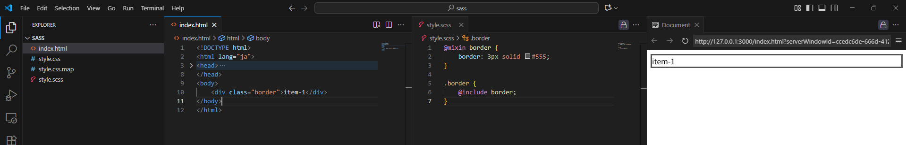
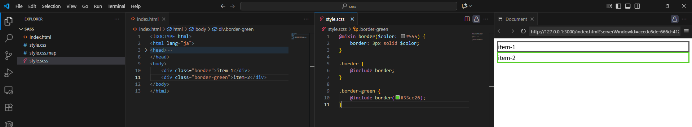
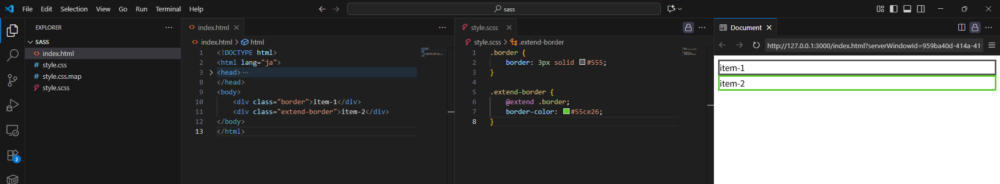
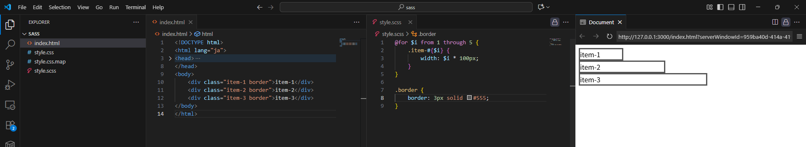
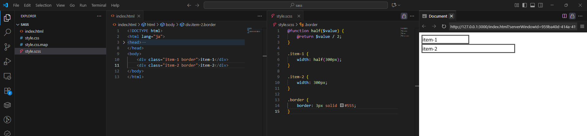
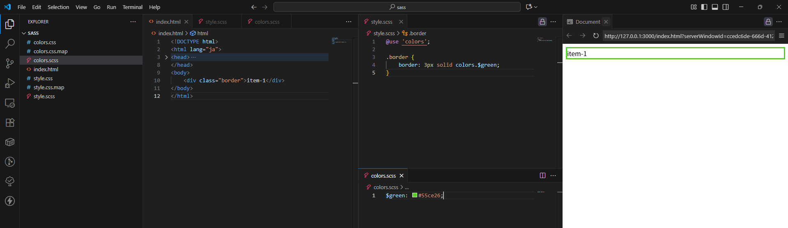
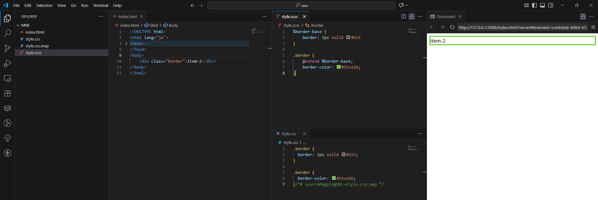

お疲れ様です。 
プライベートのWeb開発でSassを利用していて、入れ子って便利だなぁぐらいにしか思っていなかったのですが、知人からsassのmixinについて勧められたのでmixinについて調べてみました。 

## @mixinとは

一言でまとめると、スタイルの再利用ができる仕組みです。 
よく使うスタイルをまとめておき、後で呼び出すだけで利用できるような仕組みです。 

## 実際に触ってみる

@mixinで定義して@includeで呼び出す形です。 
今回はborder指定ですが、中央揃え用のスタイルとかは一括指定で簡単にできそうですね。 

また、引数を用意することも可能なようで、引数なしの場合はデフォルト値で適用させることもできるようです。 

## その他

ついでなので、sassの特徴が他にないか調べてみました。 
思いの他いろいろできるみたいですね👀 

* 継承(@extend)：スタイルの引継ぎ

  

* 制御構文(@if, @for, @each)：ifとかforとかよくあるプログラミングっぽい挙動

  

* 自作関数：引数なしでも実行可能な関数作成機能

  

* インポート：別ファイルの参照(名前空間付きらしい)

  

* Placeholderセレクタ：css出力されないが、@extendで呼び出せる

  