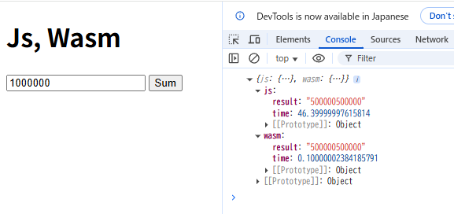

# WebAssemblyに挑む

お疲れ様です。<br>
少し前から言葉自体は知っていたものの、なかなか手が出せなかったのですが今回本腰入れて調べてみました。<br>

## WebAssemblyとは？

誕生自体は2017年と非常に新しい技術です。<br>
WebAssembly(略してWasm)はWeb上で動くプログラムのバイナリ形式でブラウザでもネイティブ並みに高速で処理できるのが特徴です。<br>

## 何がすごいの？

このWasm何がすごいかというとブラウザ(フロント)でバックエンド処理を爆速で動かせることです。<br>
これまでフロントの処理はjsが基本でしたが、jsはインタプリタだったり動的型付けだったりと遅いことで有名な言語の一つでもありました、、<br>
そのデメリットをWasmで解消することができるのが最大の強みになります。<br>
他にもWasmへの変換がサポートされている言語も結構あり、既存の言語で開発できるというのも強みの一つだと思います。<br>
<br>
サーバーサイドでCやRust等爆速の言語で処理すれば大して変わらないのでは？と思う方もいるかと思います。<br>
違いとしては、何度もサーバー側の関数を呼び出すと、(リクエスト送信 → サーバー処理 → レスポンス受信)のように通信コストがかかるのでその分遅くなります。<br>
それがフロントで実行できるとなると呼び出し処理がなくなるのでその分早くなるというわけです！<br>

## 実行までの流れ

おおよそ以下の4ステップで実行されます。<br>

1.サポートされてる言語で処理を記載<br>
Web側で呼び出す用の関数を記載します。<br>

```rust
use wasm_bindgen::prelude::*;

#[wasm_bindgen]
pub fn sum_wasm(n: i64) -> i64 {
    (1..=n).sum()
}
```

2.コンパイルしてWasmに変換<br>
コマンドでコンパイルします。<br>
コンパイルするとwasmファイルが生成されます。<br>

```docker
FROM rust:1.82 as builder

# wasm-pack をインストール
RUN cargo install wasm-pack

WORKDIR /app
COPY . .

# WebAssembly をビルド
RUN wasm-pack build --target web --release

# 実行環境 (nginx)
FROM nginx:alpine
COPY --from=builder /app/pkg /usr/share/nginx/html/pkg
COPY index.html /usr/share/nginx/html/
```

```toml
[package]
name = "sumwasm"
version = "0.1.0"
edition = "2021"

[lib]
crate-type = ["cdylib"]

[dependencies]
wasm-bindgen = "0.2"
```

```shell
docker build -t wasm-test .
docker run -p 8080:80 wasm-test
```

3.ブラウザにロード・関数呼び出し<br>
fetchで取得して取り込み、関数を呼び出して処理を実行させます。<br>
言語によってはラッパーを介して処理したり、jsに関数自体を登録したりと様々です。<br>

```html
<!DOCTYPE html>
<html>
<head>
    <meta charset="UTF-8">
    <title>Js, Wasm</title>
</head>
<body>
    <h1>Js, Wasm</h1>
    <input id="limit-number" type="number" value="1000000">
    <button id="btn">Sum</button>

    <script type="module">
        import init, { sum_wasm } from "./pkg/sumwasm.js";

        async function main() {
            await init();

            document.getElementById("btn").addEventListener("click", () => {
                const limitNumber = parseInt(document.getElementById("limit-number").value);

                // JS 計算
                const jsStart = performance.now();
                let jsTotal = 0n;
                for (let i = 1n; i <= BigInt(limitNumber); i++) {
                    jsTotal += i;
                }
                const jsEnd = performance.now();

                // Wasm 計算
                const wasmStart = performance.now();
                const wasmTotal = sum_wasm(BigInt(limitNumber));
                const wasmEnd = performance.now();

                const results = {
                    js: {
                        result: jsTotal.toString(),
                        time: (jsEnd - jsStart)
                    },
                    wasm: {
                        result: wasmTotal.toString(),
                        time: (wasmEnd - wasmStart)
                    }
                };

                // 結果表示
                console.log(results);
            });
        }

        main();
    </script>
</body>
</html>
```

## 実行結果

今回はjs(Vanilla Js)とWasm(変換前はRust言語)との実行速度の差を図るために1~nまでの総和を求める処理で比較してみました。<br>
上記のコードを実行すると、以下のような結果になります。(計測単位はms)<br>
いくらRustのコンパイラが優秀だとしても一目瞭然ですね、、(loop strength reductionという仕組みがあるらしい)<br>



## 余談

対応言語としては他にもGoやPython等あるようですが、ガーベジコレクションやスケジューラ、インタプリタそのもの等の管理コストなどが加わったりする都合上、CやRustの方が速度は軍配が上がるようです。<br>
直接的なDOM操作やファイルの参照ができないデメリットもありますが、今までの重い処理はサーバーサイドで実行するという考えも変わりそうな結構革命的な技術だと思います。<br>
<br>
今回はAIに頼り気味の開発でしたが、Rustの勉強をしたり書いてる途中LLVMとかJITコンパイラとか色々用語出てきたりしたのでそうした用語を調べてみるのも面白そうだなと思いました。<br>

## 参考リンク

* https://staff.persol-xtech.co.jp/hatalabo/it_engineer/641.html

* https://llvm.org/devmtg/2021-02-28/slides/Patrick-rust-llvm.pdf

<br>