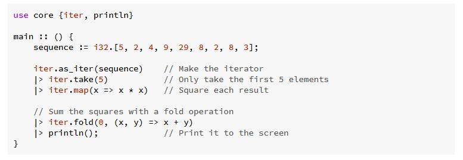

お疲れ様です。<br>
少し前にWebAssemblyとは何か？について投稿しましたが、調べていくうちにWebAssemblyを第一ターゲットとしたOnyx言語がありましたのでそちらについて勉強してみました。<br>

## Onyx言語とは？

2023年にできたとんでもなく新しい言語です。<br>
WebAssembly専用にコンパイルされるWebassembly特化の言語で、onyx runでビルドと実行を同時にしたり、wasmファイルとしてビルドしてwasmer等で実行する形も取れるようです。<br>

> Onyx compiles solely to WebAssembly. You can use a builtin WebAssembly runtime using onyx run, or compile to WASM and run using a WebAssembly runner, like Wasmer or Wasmtime.<br>

参考：https://onyxlang.io/<br>

<br>
書き方はGoやRustのような簡略化された若干とっつきづらそうな記法でした。<br>
Elixirのパイプ演算子っぽいものもあるので、いろんな言語から影響は受けていそうです、、<br>



参考：https://docs.onyxlang.io/book/philosophy/design.html<br>

## 試しに実装してみる

前は総和を求めましたが何度も同じでは味気ないので、今回はraylibというライブラリを用いて描画処理を実装してみました。<br>
<br>
何をしているかと言うと、1/60秒単位でn個の円に対して座標を個別に指定し、都度再描画しています。<br>
座標指定もx座標y座標、加減速や横揺れを作ったのでそれらも更新の関数が走る度に数値計算され新しい座標軸で更新されます。<br>

割とサクサク動いている10000個の場合でも、ざっくりの処理だけで1秒間に10000 * 60 * 5 で3,000,000回ぐらいは処理されてます。(描画そのものの処理や画面最下部を超えた場合のif条件は省いているので軽く1000万はオーバーしそうですね、、)<br>
<br>
今回はデスクトップアプリとして立ち上げましたが、wasmであることに変わりないので理論上はwebで描画しても近いパフォーマンスが出るはずです！<br>

```c
#load "./lib/packages" 

use core {*}
use raylib

// 構造体定義
// 雪の粒の状態(位置、サイズ、落下速度)を格納
Snowflake :: struct {
    x, y: f32;  // 現在の座標
    size: f32;  // サイズ(描画時の半径)
    speed: f32; // 落下速度
    phase: f32; // 揺れ
}

// 動的配列定義
snowflakes: [..] Snowflake;

// 定数定義
WINDOW_WIDTH :: 960.0f;
WINDOW_HEIGHT :: 540.0f;
NUM_FLAKES :: 500; // 描画する雪の総数
FLUTTER_STRENGTH :: 10.0f; // 揺れの最大振幅 (横方向の移動幅)
FLUTTER_FREQUENCY :: 3.0f; // 揺れの周期(値が小さいほどゆっくり揺れる)
TURBULENCE_STRENGTH :: 5.0f; // 落下速度の加減速

// 雪の粒をランダムな位置と速度で初期化する
initSnow :: () {
    random.set_seed(os.time()); 
    // 雪の粒の配列を生成
    for NUM_FLAKES {
        flake: Snowflake;
        flake.x = random.float(0, WINDOW_WIDTH); 
        flake.y = random.float(0, WINDOW_HEIGHT); 
        flake.size = random.float(1.0, 3.0); 
        flake.speed = random.float(50.0, 150.0) / flake.size; 
        flake.phase = random.float(0, 2 * math.PI);
        
        // 配列に雪の粒を追加
        array.push(&snowflakes, flake);
    }
}

// 更新処理
updateSnow :: (dt: f32) {
    for &flake in snowflakes {
        // 落下処理
        random_turb := (random.float(-1.0, 1.0) * TURBULENCE_STRENGTH);
        flake.y += (flake.speed + random_turb) * dt;

        // 横揺れ
        flake.phase += FLUTTER_FREQUENCY * dt;
        sway_velocity := math.sin(flake.phase) * FLUTTER_STRENGTH;
        flake.x += sway_velocity * dt;
        
        // 画面下端を超えたら、上に戻す
        if flake.y > WINDOW_HEIGHT {
            flake.y = 0; 
            flake.x = random.float(0, WINDOW_WIDTH);
            flake.phase = random.float(0, 2 * math.PI);
        }
    }
}

// プロシージャ
main :: () {
    initSnow(); 
    raylib.InitWindow(~~WINDOW_WIDTH, ~~WINDOW_HEIGHT, "Onyx Snow Animation");
    raylib.SetTargetFPS(60);

    while !raylib.WindowShouldClose() {
        // 更新処理
        dt := raylib.GetFrameTime(); 
        updateSnow(dt);

        // 描画処理
        raylib.BeginDrawing();
        raylib.ClearBackground(.{20, 55, 60, 255}); 

        // すべての雪の粒を描画
        for flake in snowflakes {
            raylib.DrawCircle(~~flake.x, ~~flake.y, flake.size, .{255, 255, 255, 150})
        }
        raylib.EndDrawing();
    }
    raylib.CloseWindow();
}
```

## まとめ

2023年にできたということでドキュメントは多くないですが、公式ドキュメントが思いのほか読みやすかったので既存の知識で結構戦える言語だなと思いました！<br>
また、公式のリンクからオンラインの実行環境も用意されておりそういった意味でも触りやすいと思うので気になった方は是非調べてみてください✨<br>
