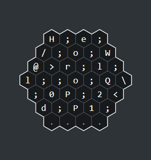
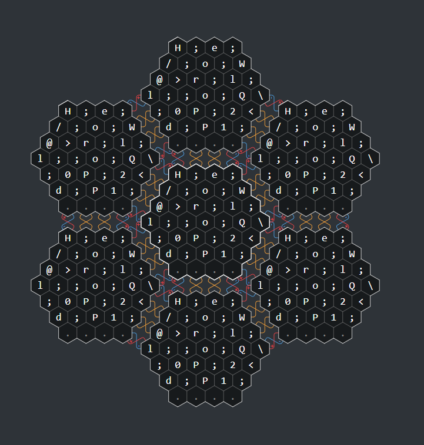
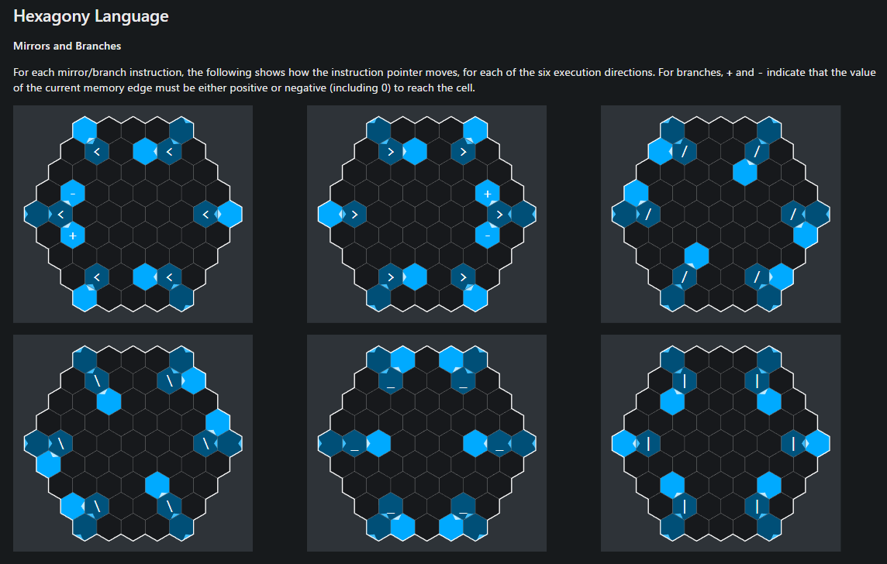

# あの言語を触ってみる【Hexagony編】

お疲れ様です。<br>
以前紹介したBefungeと似た仕組みを持つぶっ飛んだ言語を見つけたので紹介いたします。<br>

## Hexagonyとは？

Hexagonyは六角形でコーディングされた領域に対して処理方向をあっちこっち向きを変えて逐次処理をしていく言語です。<br>



名前の由来は六角形を意味する「hexagon」と苦悩を意味する「agony」を組み合わせた造語のようです。いかにも難解プログラミングっぽい命名でワクワクしますね！<br>

> The name is a portmanteau of "hexagon" and "agony", because… well, give programming in it a go.<br>

参考：https://github.com/m-ender/hexagony<br>

## ぶっ飛んだ仕様

公式サイト見て面白そうだなぁと思ったのも束の間、あまりにピンと来なくて2週間はほったらかしてました。<br>
他の難解プログラミング言語とも異なるぶっ飛んだ仕様を3つ挙げます。<br>

### 画面端から画面端への遷移

Hexagonyですが、六角形のサイズは可変であるものの、六角形でコードが記述される都合上必ず「端」に行きつきます。<br>
例えば右端に到達した場合には今度は左端に行きますが、その際も条件分岐でどの左端から始まるかも変わるのでめちゃくちゃです。<br>
※参考までの記載ですが、以下画像の黄色は無条件で結びつくセル側に遷移し、赤と青に関してはポインタが正値 か 0を含む負値かで行先が変わるイメージです。<br>



### ミラーとブランチ

以前紹介したBefungeはあくまで縦横方向への切り替えが可能でしたが、Hexagonyでは斜め方向への移動も可能になるためより複雑な仕組みになります。<br>



参考：https://hexagony.net/about.html#mirrors-and-branches<br>

### メモリ管理

メモリといえば長方形の長い箱をイメージされる方が多いと思いますが、Hexagonyではそれすら異なります。<br>
メモリは六角形で定義され、その六角形の各辺に値が保持されるイメージです。<br>
それだけならまだいいのですが、メモリの移動のために方向の概念があり、コードによっては向きを反転したり、後ろを向いた状態で右後に移動するコマンドもあるのでかなり複雑です。<br>

<br>
それでも、メモリが複数用意されているので難解プログラミング言語としてはかなり優しい仕様です。<br>

## Hello, World!

処理の動きこそ複雑なものの、処理自体は意外とシンプルで文字をスタック⇒出力をひたすら繰り返しているだけです。<br>

## 問題を解いてみる

毎度変わらずですが通常の高級言語では数行で書ける問題を解いてみました。<br>
問題としては1~99までを増分しながら出力するというものです。<br>
もう少し圧縮できるとは思いますが、六角形のサイズを縮小するとそれまでのコードの処理順も変わってしまうのでそこそこのサイズで良しとしました、、<br>

```c
     1 { 1 = \
    / 0 1 { < .
   . > 0 = { { \
  > _ } = 0 1 < .
 . / ' ; } { ) \ .
  . ! . . . . " .
   . > _ _ % < .
    @ . . . . .
     . . . . .
```

## まとめ

実装はある程度処理単位でまとめて記載もできますが、コードゴルフのコードとか見ると同じセルを上から下から左右からと何度も通るような処理もあるので奥深さも備えていて面白かったです。<br>
短く記載することに関しては他の難解プログラミング言語と比べても群を抜いていて難しくリファクタリングは絶対したくない、そんな言語でした<br>

https://hexagony.net/<br>

<br>
