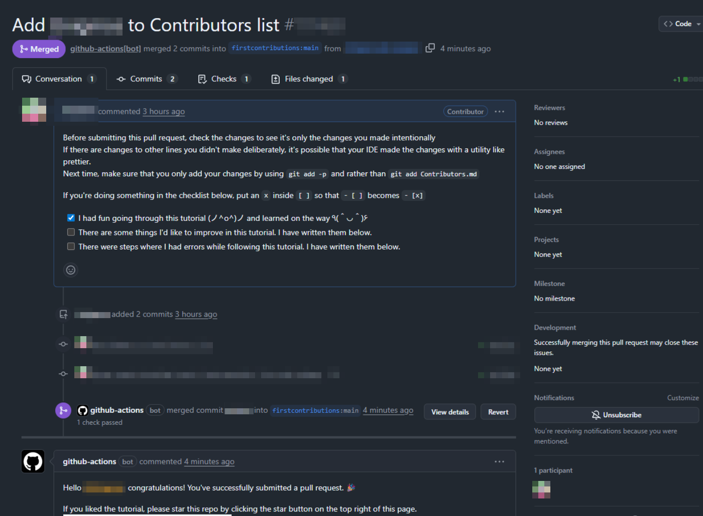

お疲れ様です。 
OSS(Open Source Software)という言葉自体はよく耳にしますが、実際どんな体制でどのように動いているのかって全く知りませんでした。 
とりあえず触ってみようとgood first issueのリポジトリ探してはみたのですが、いきなりOSS探してコードの編集しろってのもハードルの高い話なのでまずは動きを理解するために以下リポジトリで初コントリビュートに挑戦してみました。 
https://github.com/firstcontributions/first-contributions 

## first-contributionsリポジトリ

やることはすんごくシンプルで、「Contributors.md」に自分の名前を追加するだけなので本当に誰でもできます。 
 
流れとしては以下です。 

1. リポジトリをフォークして自分のリポジトリに配置

1. クローンして新規ブランチを追加

1. 名前を追加してコミット、プッシュ、プルリクエストを出す

あとはリポジトリ側でbotが動いて勝手にマージしてくれます。 

## 学びプチ共有

* git checkoutと似たgit switchコマンドが存在する(ブランチ切り替え特化のコマンド)

* コンフリクト対応時はフォークしたリポジトリではなく本家のリポジトリからupstreamを追加、反映させる必要がある

## 所感

ブランチ名どうするべきかとか、他の人のPRどうなってるんだろうとか名前を変更するだけでも色々見れて良い経験だったと思います。 
小一時間あればできるものなので、OSSコントリビュートのきっかけとして是非いかがでしょうか？ 

 