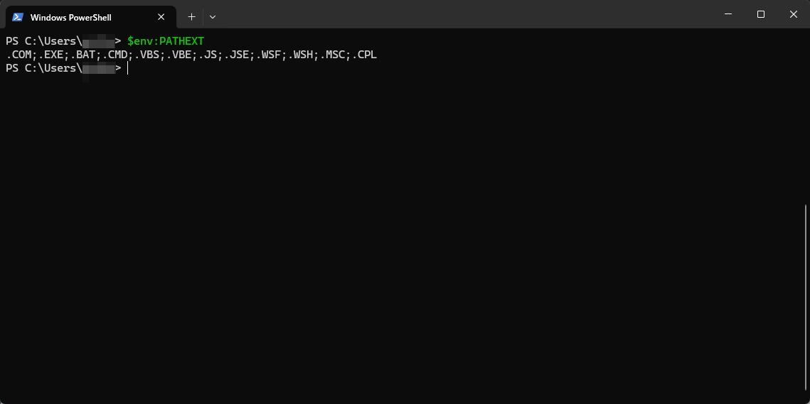
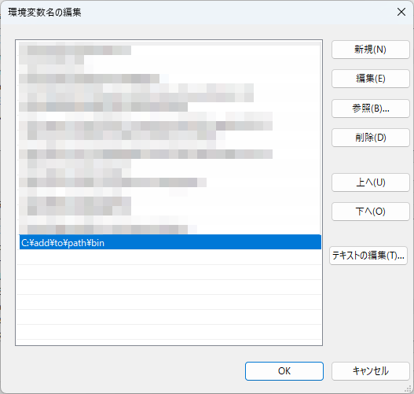
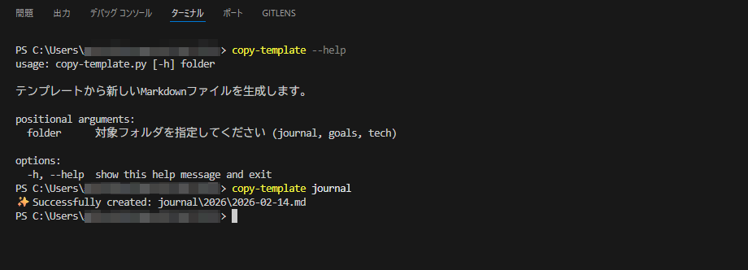
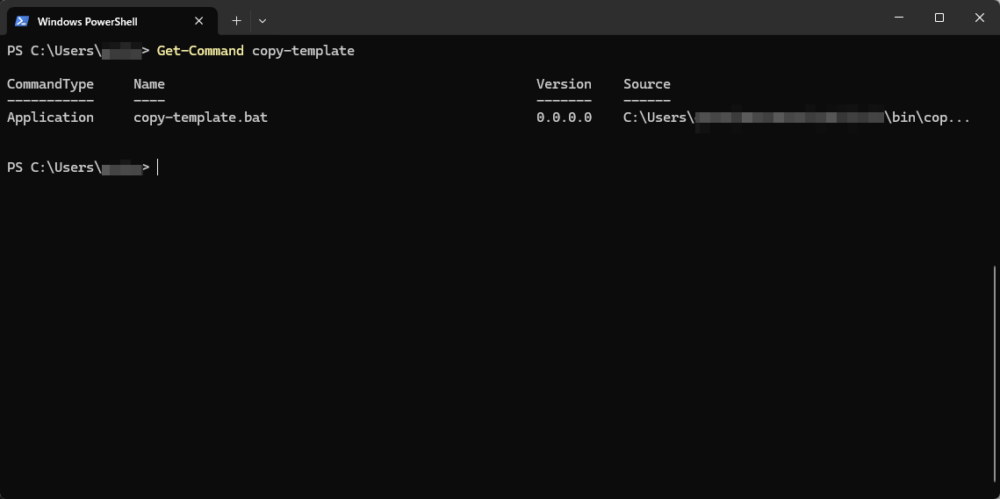

# オリジナルコマンドを作る

コーディングしててふと思うことがあります。<br>
「…自作コマンド作ってたらかっこよくね？」<br>
主観かもしれませんが、同じ動作をする以下2つのコマンド見比べたときに個人的には後者の方がぐっとくるんです。<br>

```powershell
> python copy-template.py
```

```powershell
> copy-template
```

考えてみたのですが、多分このあたりが理由なのだと思います。<br>

* タイプの量が少なくなる

* 一度設定すれば階層をわざわざ合わせる必要がない

* —helpみたいなオプションを用意すればちょっと優しく見える

* README等でまとめるとやってる感がでる

前置きが長くなりましたが、コマンドが動作する仕組みと作り方について紹介したいと思います。<br>

## 動作する仕組み

cdやdirコマンド等の元から組み込まれているコマンドを除き、大体のコマンドは外部コマンドとして特定のexeファイルやbatファイル等を呼び出すことでコマンドとして動作します。<br>
PowerShellだと`$env:PATHEXT`でどんな拡張子がすぐに実行できるか確認できます。<br>



## 作り方

大きく以下ステップになります。<br>

* 実行可能なファイルを作成する

* 作成したファイルに対してパスを通す

### 実行可能なファイルを作成する

先述した`$env:PATHEXT`からファイルの種類を選び作成します。<br>
今回は作成も呼び出しもしやすいbatファイルで作成しました。<br>
ファイルパスは適宜修正してください。<br>

```powershell
@echo off
setlocal
python "%~dp0..\scripts\copy-template.py" %*
endlocal
```

### 作成したファイルに対してパスを通す

pythonのインストールにもあるような「Add Python 3.X to Path」と同じで、ここに実行可能なファイルがあるよってWindows側に知らせる必要があります。<br>
システム環境変数の設定からPathを追加します。<br>



後は再起動すればコマンド実行できます！<br>



※ちなみにPowerShellにGet-Commandというコマンドもあるのでそこからもちゃんと識別できてるか確認できるみたいですね👀<br>



<br>