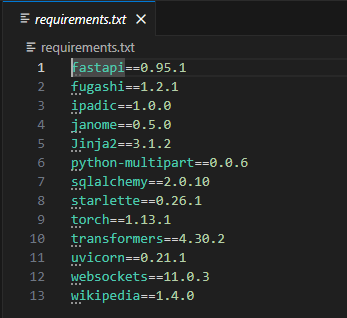
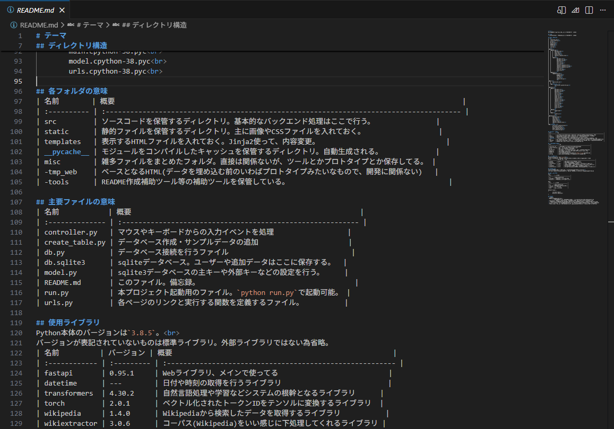
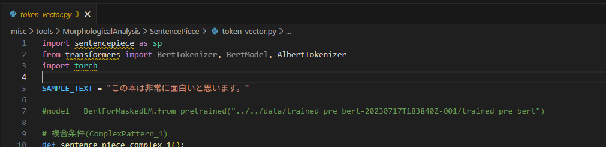
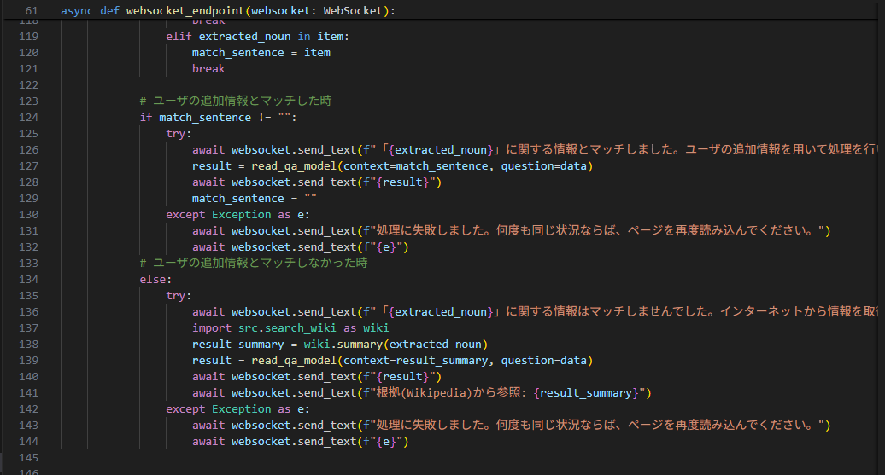

お疲れ様です。 
先日、プライベートで利用しているGitHubのリポジトリの中に大学時代に組んでいたプロジェクトを見つけ、「当時どんな感じだったかな。。」とふと気になったので、当時作成したpythonのプロジェクトをセルフレビューしてみました。 

## 良かったポイント

* Importのバージョン管理 
Pythonはrequirements.txtというファイルで導入するライブラリを管理できるのですが、バージョンもしっかり記載されていたので良かったです。 
⇒調べたらpip-toolsなるバージョン管理用のライブラリもあるみたいですね！

  

* READMEの作成 
コードレビューとは少し離れますがREADMEに色々書いてありました。 
これのおかげで思い出せた場所もあったのでやはりドキュメントは大切です。エライ。

  

## 要改善ポイント

* コメントアウトしたコードや使っていないimportが残っている 
誰に見せる訳でもなかったので仕方なかったかもしれませんが、いざ見返すと見にくいですね、、 
大量にprintしている場所もあったので、不要なコードは極力消した方が良いですね

  

* 文字列べた書き 
同じ文言もあるので、保守性考慮すると定数として一元管理したほうが良かったなと

  

* git管理で管理されていない！！ 
gitを全然理解できていなかったのはありますが、今思うと結構無茶してますね、、 
チーム開発なら詰んでいたと思います。

## まとめ

当時は全容把握していましたが今見返すと煩雑な記載になっているものも多かったので、ドキュメントの大切さを改めて実感できました。 
また、エンジニアとして2年近く働いてきてコードの善し悪しがある程度判別できるようになったのは成長を実感できている点でもあるので、良かった点を残しつつ改善点は修正できるように定期的にコード残すのも面白そうだなと思います。 

 