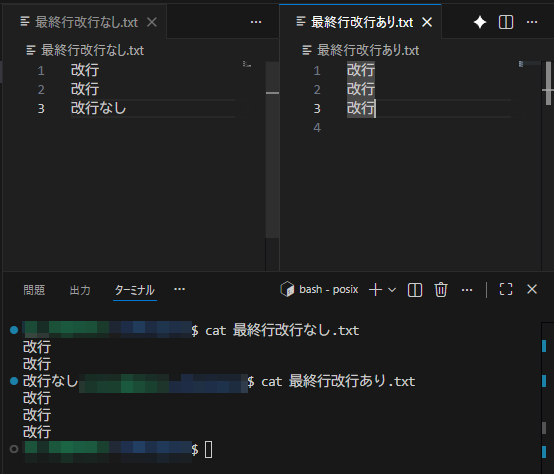
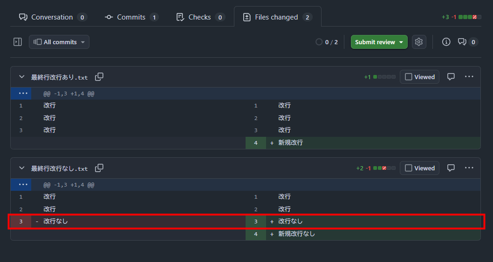

最近プライベートのプロジェクトでeditorconfigという拡張機能を組み込むことが多いのですが、その中の項目に以下のような設定ができます。<br>

```json
insert_final_newline = true
```

処理自体はファイルを保存時にファイルの末尾に改行コードを入れるだけなのですが、何でこれがあるのか・設定として必要なのかを知るべく調べてみました。<br>

## POSIX

IEEEが定めているPOSIX(Portable Operating System Interface)という規格があり、その中でテキストついては以下のように定義されているとのことです。<br>

> 1. テキストファイルは0行以上の行にまとめられた文字を含むファイル<br>
2. 行は改行コードのみ、もしくは行の最後に改行コードがある文字列<br>

※参考：https://qiita.com/Soar/items/8d75fa8b6609645b0753<br>

要は各行には改行コードがあるべきだよねってことみたいです。<br>
逆を言えば他の行には改行あるのに最終行だけ改行ないっていうのも言われてみれば違和感ですね。<br>
POSIX自体は共通の規格を設けることによってこのOSでは動くけどこのOSでは動かない(Unix戦争)みたいな問題をなくすために定義されているもののようで、共通化の背景で設定されていそうです。<br>

## 最終行に改行を入れることによるメリット

POSIX準拠しなくても今は大体のプログラムは動くと思いますが、設定することによるメリットもいくつかあるので紹介します。<br>

### catコマンド

catコマンドといえばテキストファイルの内容を表示できるコマンドですが、最終行に改行がないと最終行出力が終わったまま次の入力受付になってしまうのでちょっと気持ち悪さがあります。<br>



### Gitでの差分

Gitでもちょっとしたメリットがあります。<br>
最終行に改行をつけないと、新規で行を追加したときに「改行」が入ることによって内容自体に変更がなくても差分として出てきてしまいます。<br>
たった1行ですが、レビューのリソースを削ることもできます。<br>



画像だと、「最終行改行なし.txt」の3行目で上記の現象が起こってます。<br>