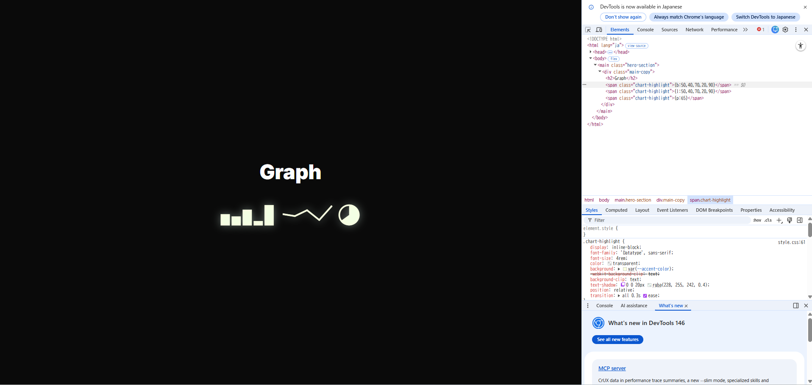

# グラフ描画ができるフォント「Datatype」

https://coliss.com/articles/freebies/turns-text-into-charts-datatype.html#h202 

上記の記事で紹介されていたのですが、グラフ描画ができるDatatypeフォントなるものがあり、触ってみたのでその紹介になります。 
 
cssでfont-familyを指定して、{b:15,45,80,30,60}のように指定すれば勝手にグラフにしてくれます！ 
スタイル指定が容易な点や、インライン要素でも表現できる点、何よりグラフ描画用のライブラリを導入せずともサクッとグラフ描画できるので「とりあえずグラフを描画させたい！」みたいな場合にはもってこいなフォントでした。 

「xy軸が欲しい」とか「ホバーしたときに詳細が分かるようにしたい」みたいなところがあればさすがにグラフ描画のライブラリに軍配が上がりますが、上記記事で用いられているような、「株価のチャートをいくつか表示する」みたいな簡易的なグラフ表示にはいいですねー 