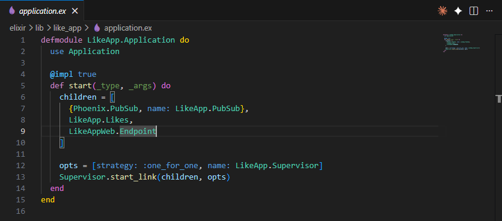
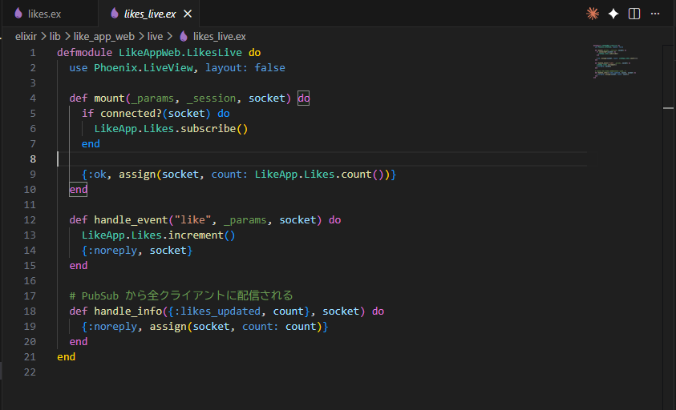
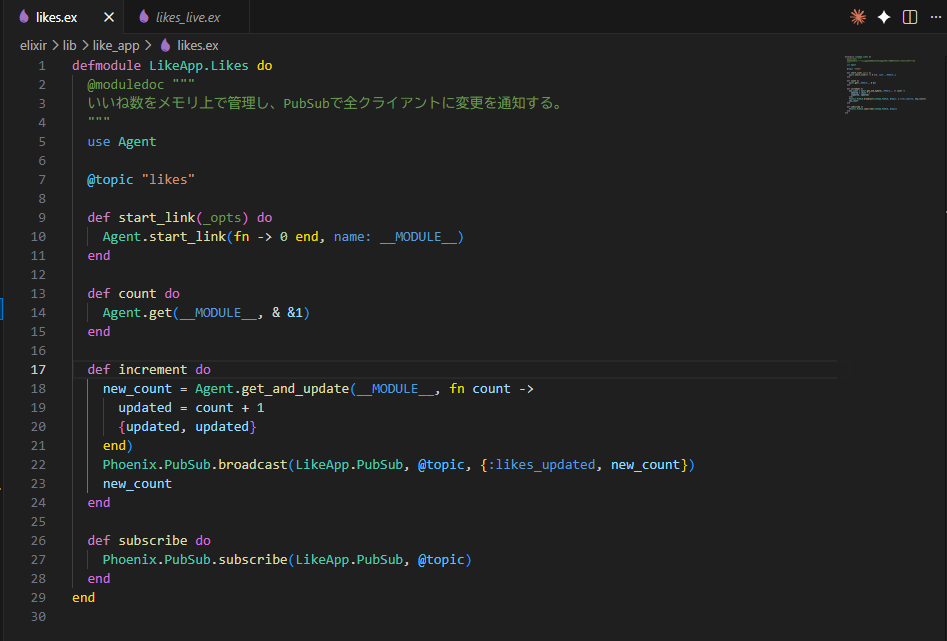

Elixir言語のphoenixフレームワークの中にLiveViewという機能があるのですが、そちらを触ってみました。 

## LiveViewでリアルタイム処理するまでの流れ

試しに全ブラウザ共通で「いいね」の値を共有するアプリを作成しました。 
作成したアプリからリアルタイム処理する流れを説明していきます。 
 
まずは、Supervisorでプロセスを立ち上げます。 
childrenに定義していますが、それぞれ以下の意味合いです。 

* PubSub: パブリッシャー/サブスクライバーの略。 
同じトピックを購読しているプロセスに変更を通知する仕組み

* Likes: プロジェクトの中で作成したもの。 
いいね数のカウントや増加を制御。

* Endpoint: リクエストを捌くところ。 
Laravelにおけるapp/Http/Kernelに相当。

次に、「/」にアクセスした際の動きです。 
細かい動きは割愛しますが、サブスクライバーとして登録して、変更を受け取る設定にします。 
そこから、サーバー側で保持している値を受け取って表示する形です。 
ボタン押した場合は1枚目の画像のhandle_eventを発火できるので、値を増分して変更をプロバイダーで通知、変更分を差分描画することでリアルタイムっぽく描画できます。 

## 何がすごいの？

LiveViewでも使っているWebSocketですが、WebSocket自体はReact等のフロントのフレームワークでも普通に使えます。 
じゃあ何がすごいかって話ですが、責任範囲の狭さと状態の集約、その軽量さにあります。 
 
フロントで実装しようとすると、useStateとかで状態を管理しておいて、WebSocket張って、イベントの送受信をフロントとサーバーそれぞれに記載して、、みたいにあっちこっちのファイルに記載が必要かと思います。 
それをLiveViewではサーバー側に状態を集約させておくので、フロントで変更用の関数を発火させる手間がなくなります。 

## 所感

全ブラウザをサクッと同期できるのは結構すごいことだとは思うので、リアルタイム性の強さを垣間見た気がします。 
まだPhoenixの記法は慣れていないですが、普段のLaravelと差別化できる部分もあるので違い知っていくのも面白いなーと思います。 

## 参考

https://speakerdeck.com/koga1020/phoenix-dot-pubsubfalseshao-jie-tohuo-yong-wokao-eru?slide=8 

https://speakerdeck.com/mokichi/elixiryi-wai-noyan-yu-moyokushi-uenziniagakao-eru-phoenix-liveviewnoshi-idokoro?slide=7 