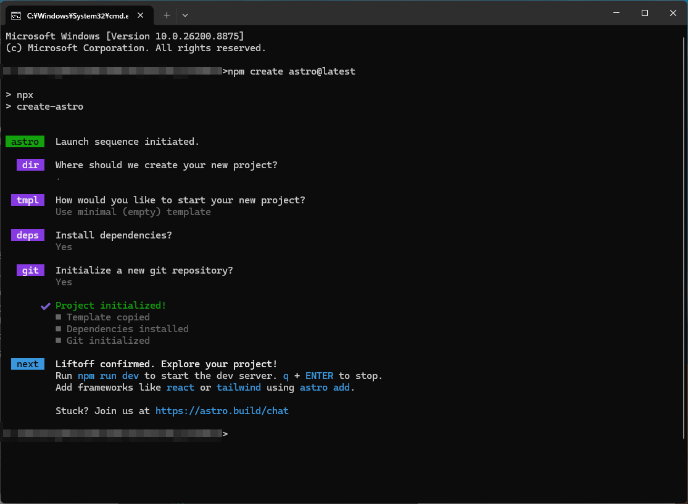
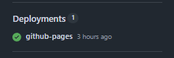

お疲れ様です。<br>
まとまった時間が取れたので、SSGとして話題になったAstroを触ってGitHub Pagesの公開に取り組んでみました。<br>

## (前段)Astroとは

Astroはコンテンツ主導型のWebフレームワークで、ビルドすると素のHTML/CSSファイルが生成されます。<br>
React等のよくあるフロントエンドフレームワークと異なり、デフォルトではJavaScriptを一切出力せず、必要な箇所だけ動的にJSを読み込む設計になっているため、非常に軽量なのが特徴です。<br>
https://astro.build/<br>

## Astro Projectの構築

`npm create astro@latest`で構築自体はサクサクできます。<br>



完了後は`npm run dev`で開発サーバの立ち上げも可能です。<br>

## ファイルの設定

試しに記事一覧画面のようなものを作ってみました。<br>
ざっくり、「---」で囲まれている上部とそれ以外の部分で分けられます。<br>

「---」で囲まれている部分はサーバ側で実行され、それ以外の下の箇所は実際に出力されるHTML部分になります。<br>

```ts
---
import { getCollection } from 'astro:content';

const posts = (await getCollection('tech'))
	.filter((post) => post.data.publish)
	.sort((a, b) => b.data.created_at.valueOf() - a.data.created_at.valueOf());
---

<html lang="ja">
	<head>
		<meta charset="utf-8" />
		<link rel="icon" type="image/svg+xml" href={`${import.meta.env.BASE_URL}favicon.svg`} />
		<link rel="icon" href={`${import.meta.env.BASE_URL}favicon.ico`} />
		<meta name="viewport" content="width=device-width" />
		<meta name="generator" content={Astro.generator} />
		<title>記事一覧</title>
	</head>
	<body>
		<h1>記事一覧</h1>
		<ul>
			{posts.map((post) => (
				<li>
					<a href={`${import.meta.env.BASE_URL}tech/${post.id}/`}>{post.data.title}</a>
					（{post.data.created_at.toISOString().slice(0, 10)}）
				</li>
			))}
		</ul>
	</body>
</html>
```

## 公開用のGitHub Actionsを定義する

ビルドからデプロイについてはGitHub Actionsで設定しておきます。<br>
mainに対してpushされた時に、ビルドしてデプロイする処理を記載します。<br>
ここまでくればmainブランチプッシュ時に自動でデプロイできるようになるので、mdを更新するだけで記事の更新も可能になります。<br>

```yml
name: Deploy to GitHub Pages

on:
  push:
    branches: [main]

permissions:
  contents: read
  pages: write
  id-token: write

jobs:
  build:
    runs-on: ubuntu-latest
    steps:
      - uses: actions/checkout@v4
      - uses: withastro/action@v3
        with:
          node-version: 22

  deploy:
    needs: build
    runs-on: ubuntu-latest
    environment:
      name: github-pages
      url: ${{ steps.deployment.outputs.page_url }}
    steps:
      - id: deployment
        uses: actions/deploy-pages@v4
```


## 所感
AIを結構酷使したこともあってか、ほとんど詰まることなくサクサク実装できたので使いやすかったです。<br>
昔Astroと似たHugoというフレームワークも触ってみましたが、当時はWebの知識がほとんどなかったので改めて触って成長感じるのもいいかもですね。<br>
