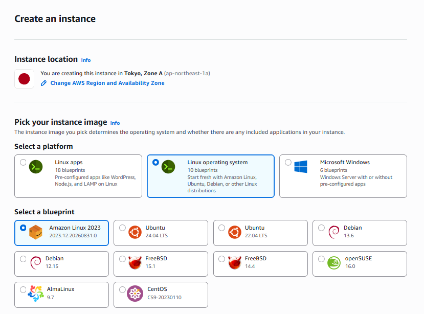
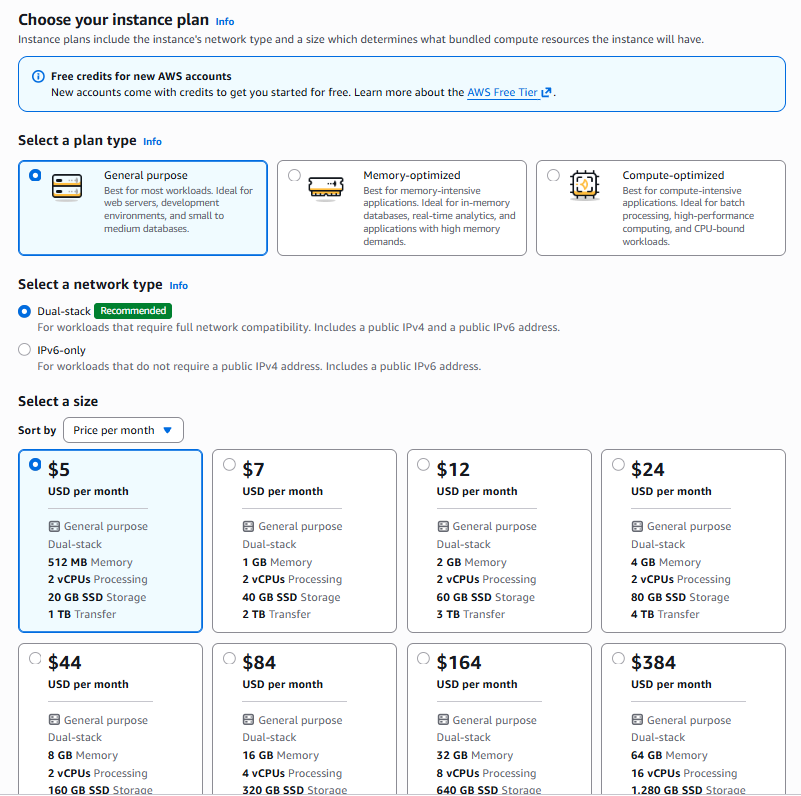

先日AWSの契約をしたので、AWSのLightsailというサービスを用いてデプロイをしてみました。 

## Lightsailとは
Lightsailは定額制でVPSを運用できるオールインワン型のサービスです。 
EC2等のように細かい設定ができる訳ではありませんが、環境構築が容易でOS設定の他WordPressやNode.jsが事前設定されたイメージを選択して起動することもできます。 

また、オートスケールはありませんが規模が大きくなればインスタンスサイズを拡張することも可能です。 

https://aws.amazon.com/jp/lightsail/ 

## Lightsail選定理由
ずばりコストです。 
最安のプランであれば月々$5で利用できます。 

サーバーレスも検討しましたが、作成したサービスが外部APIとの連携が必要であったり、そもそも言語的に不向きで実装コストに見合わないとなりLightsailに落ち着きました。 
後は上記に加えドメイン取得する必要があったのでお名前ドットコムからドメインだけ購入しました。 
※Route53と管理費比較するとお名前ドットコムの方が安そうだったのでそちらを利用しました。 
総合して、月ごとのコストは900円程度です。 

## 所感
触った感覚でいえばほぼオンプレのサーバと同じでした。 
言語が動く環境を整え、gitからcloneしてきてenvの値を適宜修正する形なのでAWSのサービス同士を連携するようなところはありませんでした。 

とはいえ、これまで触っていたレンタルサーバはドメイン+サーバがセットだったので、静的IP設定やファイアウォール設定は初の試みだったので疎通が取れた時はうれしかったです。 
後は適宜AIに設定確認しながら進めた結果ほとんど詰まらなかったので、改めてAIってスゲーなぁと思い知らされた機会にもなりました。 

大分ミニマムな構成なので仕事で利用することはほとんどないと思いますが、サクッと構築したい場合にはアリな選択肢だと思います。 
規模が大きくなればEC2等の別サービスへの移行もオンプレよりもやりやすいと思うので、機会があれば移行記録も残せればと思います。 
