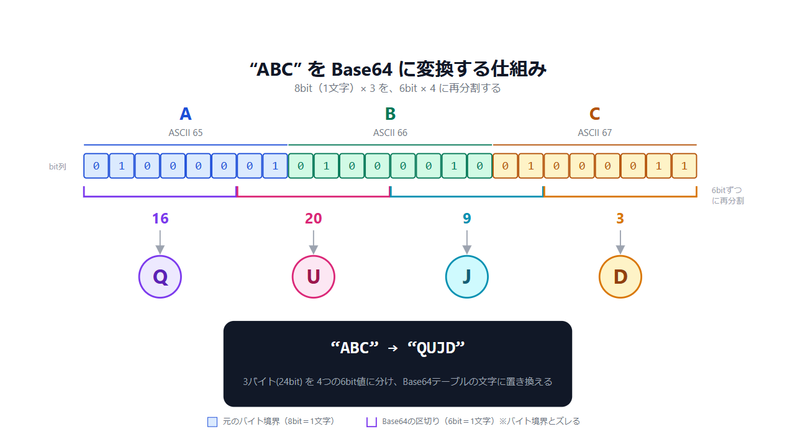

任意のデータを文字列に変換する仕組みぐらいの理解しかなかったので、この際調べてみました。 

## Base64とは
バイナリのデータを6ビットごとに区切って英数字と「+」「/」の64種類の文字に変換する仕組みです。 
6ビットとしているのは2^6=64で6ビットあればきれいに分けきれるという理由からです。 

## 変換の仕組み
文字コードに対応する2進数表記に変換します。(画像ではASCIIコード) 
その2進数を6ビット区切りにして、Base64の対応表に紐づくデータに変換するだけです。 

## 容量は1.33倍になる
24ビット分のデータを再現するのに、3バイト⇒4バイトに増えるからです。 
容量が増えてでもエンコードする理由は、単純な英数字と2種類の記号のみを用いることで、予期せぬ制御コードへの対処やOS間の仕様違いによるデータ破損や文字化けを防ぐためのようです。 

## 余談
Base64がエンコード方式としては有名だと思いますが、似た方式にBase85やBase122も存在します。 
それでもBase64が最も有名なのは、Base85等では「\」や「"」も含まれるため、エスケープ処理が必要になったり、Base64がプログラムの標準ライブラリに含まれていたりするからかなーと思います。 
